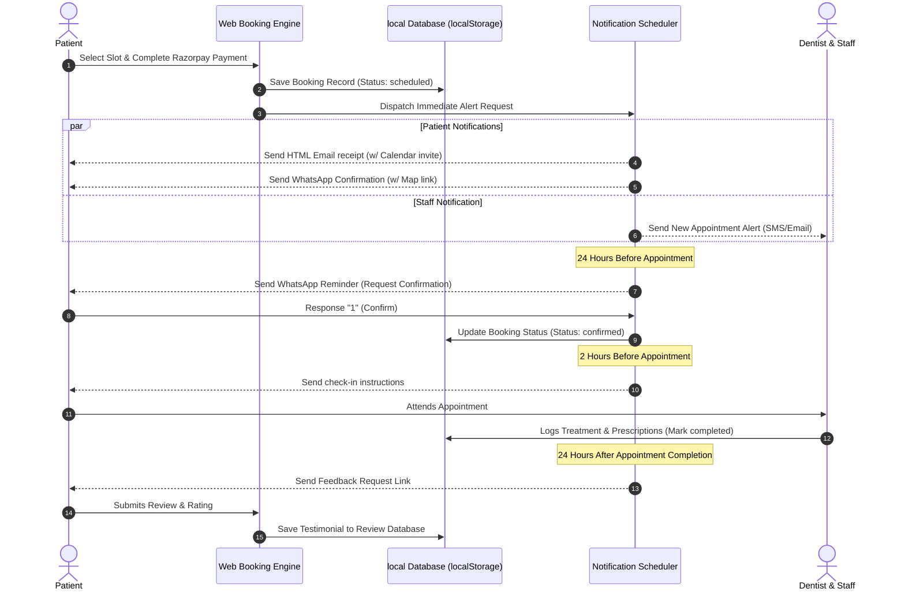

# Smile Dental Clinic - Automation Workflows

This document outlines the communication triggers and automation workflows for patient appointments.

---

## 1. Appointment Automation Steps

### 1. Email about the appointment
*   **Trigger**: Instantly triggered upon booking validation and successful Razorpay deposit.
*   **Purpose**: Serves as a digital invoice and booking receipt.
*   **Details**: Sends an HTML email containing the Appointment ID, date, selected doctor (Dr. Sanjay Ramani or Dr. Bhavna Pimpale), timing, payment status, Google Maps location link, and a `.ics` calendar invitation attachment.

### 2. WhatsApp message to customer
*   **Trigger**: Sent concurrently with the email confirmation.
*   **Purpose**: Immediate notification with high visibility.
*   **Details**: Sends a short, actionable summary directly to the patient's WhatsApp number. Includes quick buttons to click-to-chat with the clinic desk or open location maps in Santacruz.

### 3. Reminder to customer
*   **Trigger**: Two scheduled triggers:
    1.  **24 Hours Prior**: Prompts confirmation (e.g. "Reply 1 to Confirm, 2 to Reschedule"). Updates the booking status in `localStorage` based on the response.
    2.  **2 Hours Prior**: Sends clinic check-in guidelines and parking instructions.
*   **Purpose**: Reduce appointment no-shows.

### 4. Post appointment feedback
*   **Trigger**: Sent 24 hours after the appointment is marked "Attended" (completed) in the admin panel.
*   **Purpose**: Collect patient testimonials and online reviews.
*   **Details**: Prompts the patient with a link to submit a 1-5 star rating and review. Approved feedback is automatically synced to the homepage testimonial slider.

### 5. New appointment message
*   **Trigger**: Instantly sent upon booking.
*   **Purpose**: Internal notification for the clinic medical team.
*   **Details**: Alerts the attending doctor (Dr. Ramani or Dr. Pimpale) and the front-desk staff of the new appointment so they can prepare check-in records and dental files.

---

## 2. Sequence Diagram

